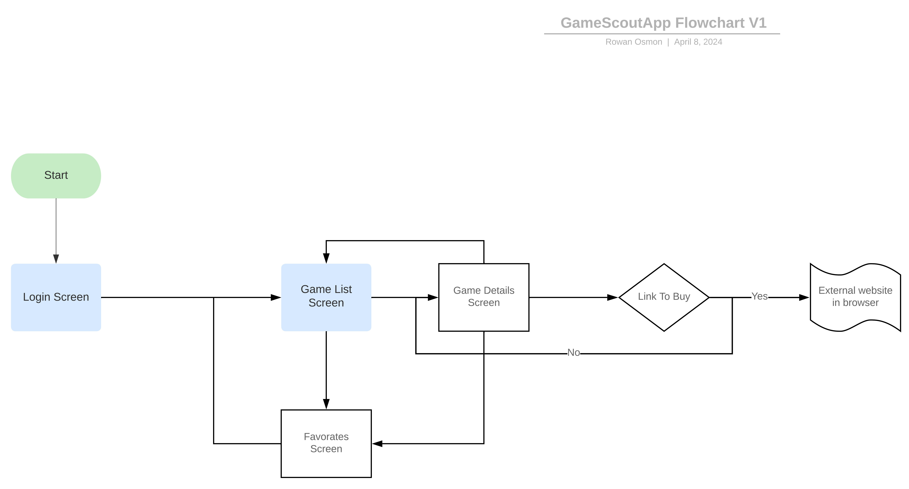
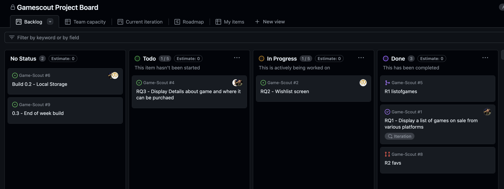
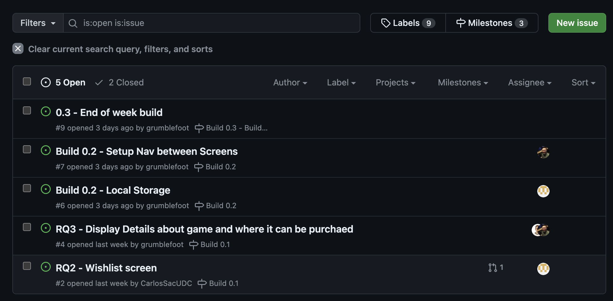

# Milestone 1 - GameScout (Unit 7)

## Table of Contents

1. [Overview](#Overview)
1. [Product Spec](#Product-Spec)
1. [Wireframes](#Wireframes)

## Overview

### Description

This platform serves as a comprehensive price comparison and tracking tool for video games across various digital distribution services, including Steam, Epic Games Store, and GOG. Users can search for any game and instantly view current prices across these platforms. The app not only displays the current prices but also tracks historical price data, allowing users to identify trends and predict future sales. Users can set up alerts for price drops or specific discount thresholds for games on their wishlist, ensuring they never miss a sale.

### App Evaluation

- **Category:** Entertainment & Shopping
- **Mobile:** Mobile functionality is critical, providing users with the flexibility to check game prices, receive alerts, and even purchase games while on the go. The app makes use of push notifications for price alerts and integrates with mobile web browsers for seamless redirection to game store pages for purchase.
- **Story:** Designed to empower gamers by providing them with the tools to make informed purchasing decisions, ensuring they get the best deals on their favorite video games. By aggregating price data from multiple stores, the app saves users time and money, fostering a more consumer-friendly gaming ecosystem. 
- **Market:** Targeted at budget-conscious gamers and deal hunters within the gaming community. The app appeals to a wide range of users, from casual players to hardcore gamers, looking to expand their digital libraries without breaking the bank.
- **Habit:** Gamers are encouraged to regularly check the app for updates on their favorite games and price alerts. The habit of “deal hunting” becomes a part of their gaming routine, with the app serving as a one-stop shop for discovering and purchasing games at the best prices.
- **Scope:** The first version (V1) focuses on basic price tracking and comparison features across major game stores. Version 2 (V2) would introduce price history graphs and customizable alerts. Future updates could add support for additional digital stores, a community-driven feature allowing users to share deals, and personalized recommendations based on user preferences and purchase history.
- **API** Uses CheapShark API to get game price comparisons. 
  
## Product Spec

### 1. User Features (Required and Optional)

**Required Features**

1. Display a list of games on sale from various platforms
2. Save Favorites and Notify when deals are available
3. Display Details about game and where it can be purchased

**Optional Features**

1. Login page with google authentication
2. Search function to find specific games
3. Suggestions based on favored games (categories)

### 2. Screen Archetypes

- Login/start Screen
  - Dummy/optional login as a feature

- On Sale list Screen
  - Display games pulled from the api that are currently discounted
  - Can touch games to navigate to the detail page
  - Search bar (optional)
  - Nav bar -> switch between favorites and this page
      - Game items - Name, platform - price- button to add to fav

- Favorites Screen
    - List of games favored by the user
    - Stored locally
    - button to delete from favorites

- Detail Screen
    - List item details such as platform, best price, alternitve price, retail price, Link to buy
    - Button to add to favorates

### 3. Navigation

**Tab Navigation** (Tab to Screen)

* Scroll Deals
* Favorates

**Flow Navigation** (Screen to Screen)

## Wireframes

## Papaer Wireframe

 

 

### [BONUS] Digital Wireframes & Mockups

### [BONUS] Interactive Prototype

 

# Milestone 2 - Build Sprint 1 (Unit 8)

## GitHub Project board

[Add screenshot of your Project Board with three milestones visible in
this section]

## Issue cards

- [Add screenshot of your Project Board with the issues that you've been working on for this unit's milestone]
  
- [Add screenshot of your Project Board with the issues that you're working on in the **NEXT sprint**. It should include issues for next unit with assigned owners.]
  
  

## Issues worked on this sprint

- List the issues you completed this sprint

  **Display a list of games on sale - On Sale Fragment:**

*  Recycler view for game items
*  Game item object created
*  Search for game bar. Needs query from api
*  button on games that adds to favorates

**Display user wishlist - Wishlist Fragment:**

* Recycler view for games on the wishlist
* Local database for games to be displayed on the recycler viewer
* Display mock data for testing

**Display details about a selected game - Details Activity**
* Should have prices for game and where the game is being sold from
* should have button to add to favorates
* should have buttons to buy games from that vender
  
- [Add giphy that shows current build progress for Milestone 2. Note: We will be looking for progression of work between Milestone 2 and 3. Make sure your giphys are not duplicated and clearly show the change from Sprint 1 to 2.]

  

 

# Milestone 3 - Build Sprint 2 (Unit 9)

## GitHub Project board

[Add screenshot of your Project Board with the updated status of issues for Milestone 3. Note that these should include the updated issues you worked on for this sprint and not be a duplicate of Milestone 2 Project board.] 

# Completed user stories

**Display a list of games on sale**
* Users can view games currently on sale from various platforms, displayed using a RecyclerView in the On Sale Fragment
  
**Game Item Object**
* Created a structured object to manage and display game data efficiently.
  
**Search for Game**
* Added a functional search bar that integrates with the API to help users find specific games.
  
**Add Games to Favorites**
* Users can add games to their favorites list through a button in the game item display, enhancing personalized tracking.
  
**Display User Wishlist**
* The Wishlist Fragment shows games from the user's favorites using a RecyclerView.
* A local database supports persistent storage and display of favorite games.
  
**Display Mock Data for Testing**
* Implemented mock data in the Wishlist Fragment to facilitate development and testing of the display and functionality.
  
**Display Details About a Selected Game**
* Developed a detailed view for each game, showing prices from various vendors, the best and alternative prices, and the retail price.
* Added functionality for users to add games to favorites and links to purchase games from specific vendors.
  
**Login Page with Google Authentication**
* Implemented a login page that supports Google authentication, allowing for user account management and personalization.

# Pending or Cut User Stories

**Suggestions Based on Favored Games (Planned for V2)**
* Planning to add a feature to suggest games based on user favorites, providing a tailored browsing experience.
  
**Detailed Price History Graphs and Customizable Alerts (Planned for V2)**
* Planning to introduce graphs showing historical price data and alerts for price drops in the next version to enhance user decision-making.
  
**Community-Driven Features to Share Deals** 
* This feature is still under consideration and may be introduced in a later version to foster a community-centric approach.

[Add video/gif of your current application that shows build progress]

## App Demo Video

- Embed the YouTube/Vimeo link of your Completed Demo Day prep video
